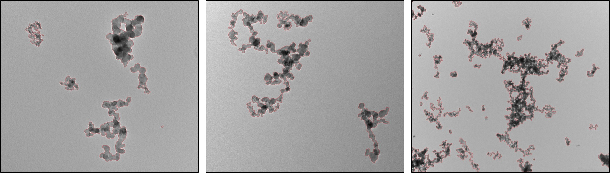

[](https://github.com/maxfrei750/CarbonBlackSegmentation/blob/master/LICENSE) 

- [ ] Update license and citation
- [ ] Add references to publication
- [ ] Add docker support
- [ ] Create 1.0 release
- [ ] Replace temporary checkpoint url
- [ ] Tidy up repository
- [ ] Publish

# CarbonBlackSegmentation

This repository is a toolbox for the easy training and application of convolutional neural networks for the segmentation of transmission electron microscopy images of carbon black agglomerates.

The utilized convolutional neural network was inspired by the Panoptic FPN architecture, developed by 
[Kirillov et al.](https://openaccess.thecvf.com/content_CVPR_2019/papers/Kirillov_Panoptic_Feature_Pyramid_Networks_CVPR_2019_paper.pdf) 
and is based on an implementation of [Yakubovskiy](https://github.com/qubvel/segmentation_models.pytorch), 
realized with [PyTorch](https://pytorch.org/).

## Table of Contents
   * [CarbonBlackSegmentation](#CarbonBlackSegmentation)
   * [Table of Contents](#table-of-contents)
   * [Examples](#example-detection)
   * [Citation](#citation)
   * [Setup](#setup)
   * [Getting started](#getting-started)

## Example 

Demos demonstrating the use of this codebase are provided in the demos folder of this repository. Classifying a set of images generally makes use of *wrapper* functions, which take a single or set of image paths and output a series of binary masks identifying agglomerates in the image. For example, 

```python
import os
from wrapper import single_image # segmenter for single image

# Specify image path.
image_path = os.path.join("test_images", "201805A_A6_004.png")

# Classify the default image
print("Classifying image...")
mask = single_image(image_path)
print("Complete.")
```

will read in a single test image, 201805A_A6_004.png, and output a mask, identifying pixels that are part of the agglomerates as `1` and pixels that are part of the background as `0`. 

Several example classifications are shown below.
 

## Citation
If you use this repository for a publication, then please cite it using the following bibtex-entry:
```
@misc{Frei.2020,
  Author = {Max Frei},
  Title = {CarbonBlackSegmentation},
  Year = {2020},
  Publisher = {GitHub},
  Journal = {GitHub repository},
  Howpublished = {\url{https://github.com/maxfrei750/CarbonBlackSegmentation}}
}
```

## Setup
1. Install [conda](https://conda.io/en/latest/miniconda.html).
2. Open a command line.
3. Clone this repository: ``git@github.com:maxfrei750/CarbonBlackSegmentation.git``
4. Change into the folder of the repository: ``cd CarbonBlackSegmentation``
5. Create a new conda environment: 
``conda env create --file environment.yml``
6. Activate the new conda environment: ``activate CarbonBlackSegmentation``

## Getting started
### Application
If you just want to segment images, then please refer to `demo.py`.
### Training
If you want to improve your segmentation results by training a model on your own data, 
then please refer to `train_model.py`.